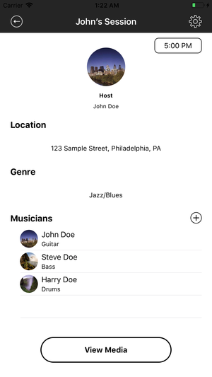
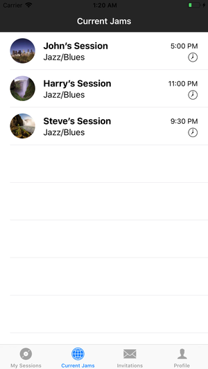

# JamCenter

### About

JamCenter changes the way that musicians organize, share, and participate in jam sessions. Through a system of digital sessions, users can invite other musicians to their own sessions and look for other sessions in their area. By creating a session, a user can record audio, publish a song-list, and even share the session through Facebook. All sessions, by default, will become inactive one day after they begin.

 

### Creating Sessions

### Finding Sessions

### Session Invitations

### Managing Sessions

### Recording Audio

### Adding to Songlists
