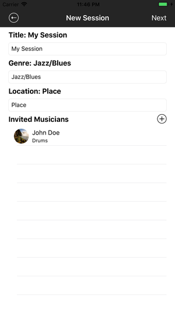

# JamCenter

### About

JamCenter changes the way that musicians organize, share, and participate in jam sessions. Through a system of digital sessions, users can invite other musicians to their own sessions and look for other sessions in their area. By creating a session, a user can record audio, publish a song-list, and even share the session through Facebook. All sessions, by default, will become inactive one day after they begin.

 

### Creating Sessions

To create a session, simply press the + button in the top-right corner of the MySessions page. This will take you a page that allows you to customize your session.

### Finding Sessions

In the Current Jams page, you will see a list of currently active sessions in your location. By selecting one of these sessions, you are given detailed information on items such as exact location and other participants. If you have already been invited to the session, you can join immediately. If not, you will need to enter a code given by the session host. Remember that these sessions, like all others, will be gone one day after their listed start times.

### Session Invitations

On the Invitations page, you will see a list of invitations that you have been given in order to join other users' sessions. By selecting an invitation, a user can immediately join a session and begin viewing media

### Managing Session Media

By selecting the settings button in the top-right of a session you host, you gain access to that session's media properties. This includes features like recording audio and adding to the songlist. Items in the songlist and My Sessions page can be deleted by swiping to the left.

 

